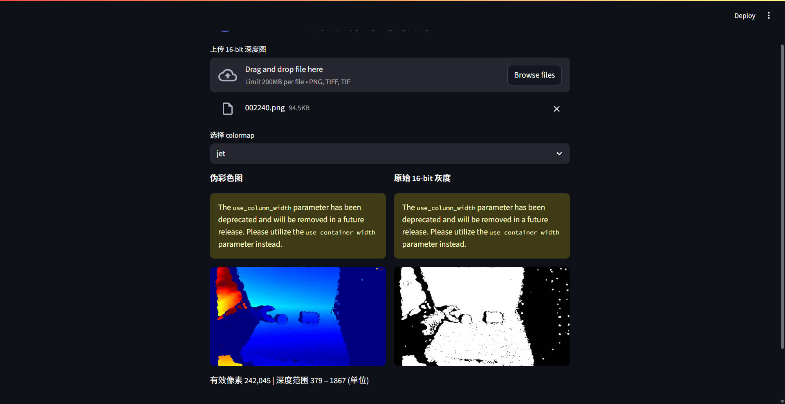

# Depth Viewer: 16-bit 深度图可视化工具


**简介**：把 16-bit 深度图拖进浏览器，2-98 百分位自动截断、一键换色，秒级可视化。



---

## 🚀 即开即用

git clone https://github.com/YOUR_NAME/DepthPeek.git
cd DepthPeek
pip install streamlit opencv-python matplotlib
streamlit run depth_viewer/depth_viewer.py

浏览器自动打开 → 上传 `.png` / `.tiff` → 立刻看到伪彩色深度图。

---

## 🎯 功能
- 自动读取 16-bit 单通道深度图  
- 2%–98% 百分位截断，过滤极端值  
- 4 种 colormap 实时切换（jet / viridis / plasma / turbo）  
- 并排显示伪彩图 & 原始灰度图  
- 统计有效像素数、深度范围

---

## 📁 目录
```
DepthPeek/
├── depth_viewer/
│   └── depth_viewer.py   # 主程序（<100 行）
├── resource/
│   └── pic1.jpg          # 网页界面示意图
├── README.md
└── LICENSE
```

---

## 🔧 自定义
| 修改点 | 路径 |
|--------|------|
|添加新 colormap | `cmap_name` 列表 |
|改默认百分位 | 编辑 `[2, 98]` |
|支持 32-bit | 把 `cv2.IMREAD_ANYDEPTH` 后强制转 `float32` |

---

## 📄 协议
MIT © YOUR_NAME  
欢迎 Star & Fork！
